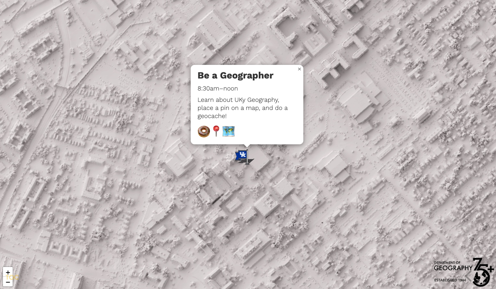
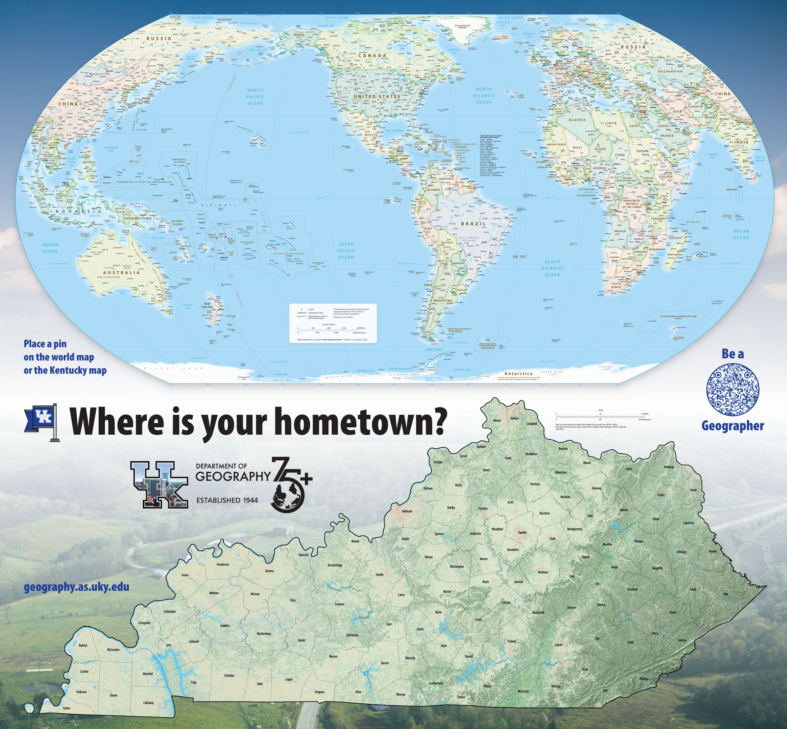

# UKy Geography Awareness Week

**When**: November 2–9, 2022   
**Where**: Around campus and online  
**What**: Learn about UKy geography, place a pin on a map, and enter a raffle!  

## Quick overview

Presentation @ https://uky-gis.github.io/geoawareness

## Main Event: Be a Geographer
November 9, 8:30 am–noon, outside [Whitehall](https://uky-gis.github.io/geoawareness/map/)

Are you curious about what geographers do? Come to Whitehall on November 9 to learn about geography and enter a raffle! We will have a variety of activities, including a geocache and a map that you can place a physical map pin that represents your hometown.

Doughnuts and assorted swag will be provided.

## Activities

We have a few self-guided activities that you can do as a warm-up for our main event.

### Where y'all from?

We have a printed map of the world and Kentucky that you can place a physical map pin on that represents your hometown. This map may come to your classroom or you can find it at our main event on November 9.

    
*Image of the printed map*

(Instructors: [schedule a time to use the map](https://forms.gle/qkvtUQKXduynUKDu6) in your classroom.)

### Where y'all from? (Online version!)

So you can't visit the map in person. That's OK! We have an online version of the map that you can use to place a virtual map pin on that represents your hometown. [Click here to place your pin](https://outragegis.com/uky-geotag/).

### After you've placed your pin...

Now what? Enter a raffle to win maps and other geography-related prizes! Complete this short form, [Wildcats Around the World](https://docs.google.com/forms/d/e/1FAIpQLSeWNSxKXnTLIKiwCCwvlvoeW70sqDK2N_B3btzDoiKXHcZn_A/viewform), where you can share fun facts about your hometown. Raffle winners will be announced on November 9, starting at 11am at our main event. Winners must be present to accept their prize.

### Geocache

We have a few virtual geocaches hidden on campus. Find one and tell us what it is at our November 9 event to enter a raffle. Geocache raffle winners will be announced starting at 11:30am, so submit your answer in person before that time. Winners must be present to accept their prize. [Click here to start geocache](https://outragegis.com/uky-geocache/).

Note: this geocache is not a physical geocache. It is a virtual geocache that you can find with your mobile device. Make sure your browser has permission to use your location. This application will store user locations in a database for educational purposes, but no personally identifiable information is collected. Come to our main event and view a real-time map of geocache participant locations.

## Want to be a Geographer?

Check out our [Spring 2023 course offerings](https://uky-gis.github.io/geoawareness/#/26).