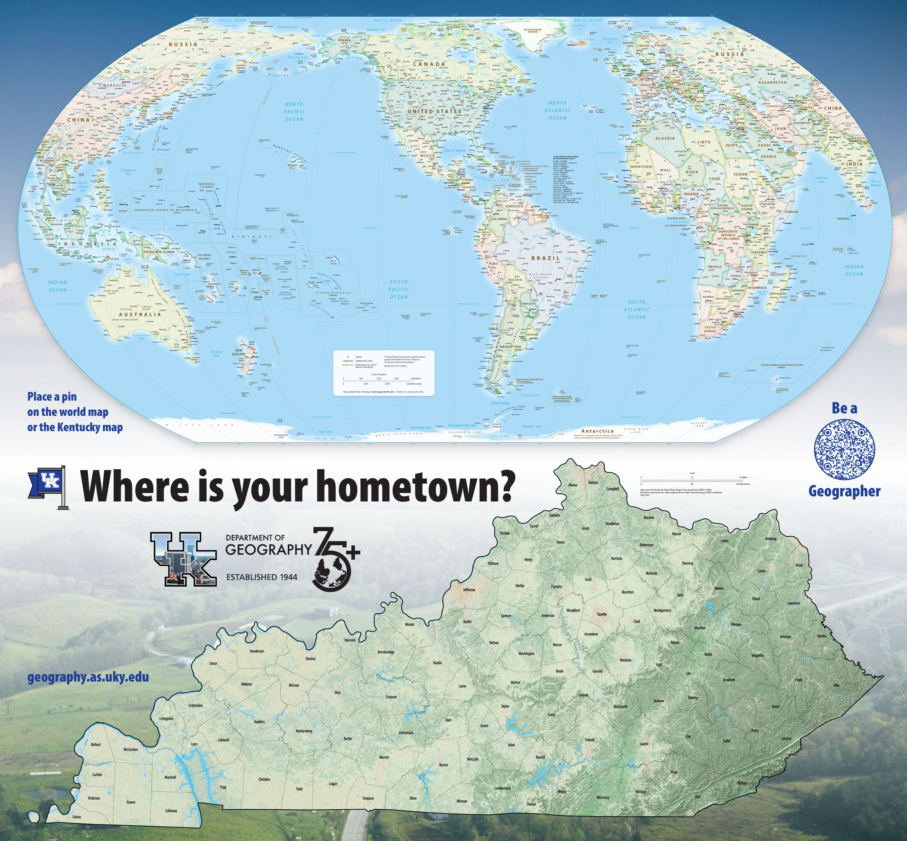

# UKy Geography Awareness Week
**When**: November 2–9, 2022   
**Where**: Around campus and online  
**What**: Learn about maps, geography, and enter a raffle!  

## Main Event: Be a Geographer
November 9, 8:30 am–noon, outside Whitehall

Are you curious about what geographers do? Come to Whitehall on November 9 to learn about geography and enter a raffle! We will have a variety of activities, including a geocache and a map that you can place a physical map pin on that represents your hometown.

Doughnuts and assorted swag will be provided.

## Activities

We have a few self-guided activities that you can do during the week.

### Where y'all from?

We have a printed map of the world and Kentucky that you can place a physical map pin on that represents your hometown. This map may come to your classroom or you can find it at our main event on November 9.

